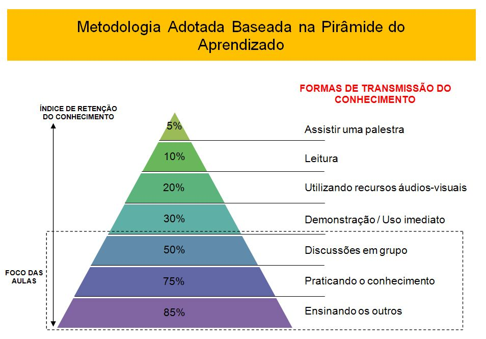

Olá, tudo bem?

Neste primeiro post vou explicar o foco e qual é o objetivo da criação deste blog e o porque estou gerando conteúdo.

No último ano venho estudando muito sobre desenvolvimento web focando na parte de criação de sites e sistemas, ambos os temas possuem um conteúdo muito misto, denso e extremamente bagunçado. Cada pessoa fala uma coisa, cada curso aborda um assunto de uma maneira... uma zona.

Para assimilar toda essa bagunça e ter um conhecimento mais fixado em minha mente irei seguir a pirâmide de aprendizagem que descobri no livro "Pai Rico, Pai Pobre"
Pirâmide do Aprendizado
Seguindo a lógica da pirâmide eu fiquei muito tempo na parte superior: Lendo, assistindo tutoriais e aplicando o conteúdo explicado no tutorial. Essas abordagens são boas inicialmente, mas a longo prazo não possuem uma eficácia relevante, levando em conta que muito do que é visto precisa ser revisado quando realmente serão utilizados.

Olhando para a base da pirâmide estou iniciando uma aplicação mais prática com códigos e treinos que posto no [Github](https://github.com/iaurg), algumas discussões em grupos de Discord e Slack e aqui ensinando o que sei.

Como a grande maioria de coisas que serão postadas aqui são assuntos que estou iniciando ou praticando existe uma grande probabilidade de poderem ser realizados de uma maneira mais eficiente ou com qualidade superior, então sempre estarei aberto á dicas, correções e críticas. Afinal preciso disso para ficar melhor e encontrar o caminho da maestria.

Então como a descrição do blog diz o foco aqui é realmente esse, estudar, aprender e trocar conhecimento, busco apenas ser melhor no que faço.

Até mais!
