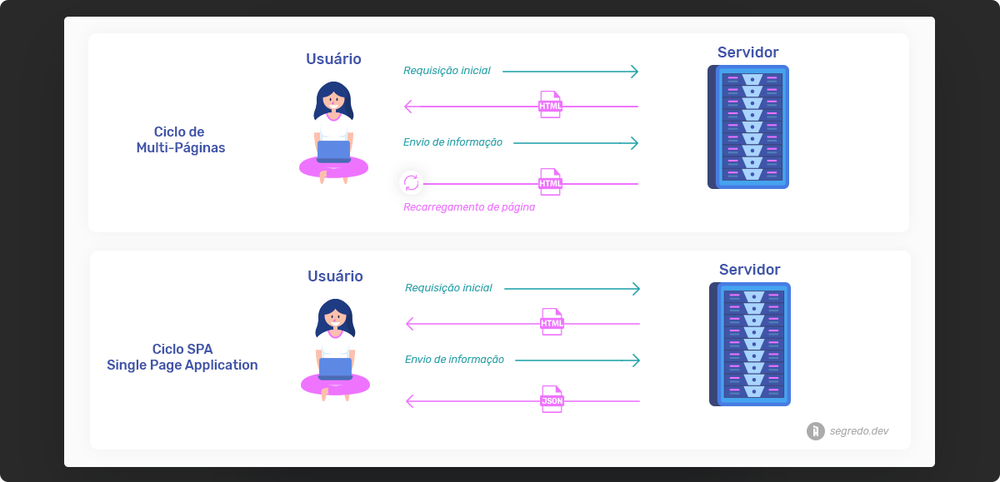
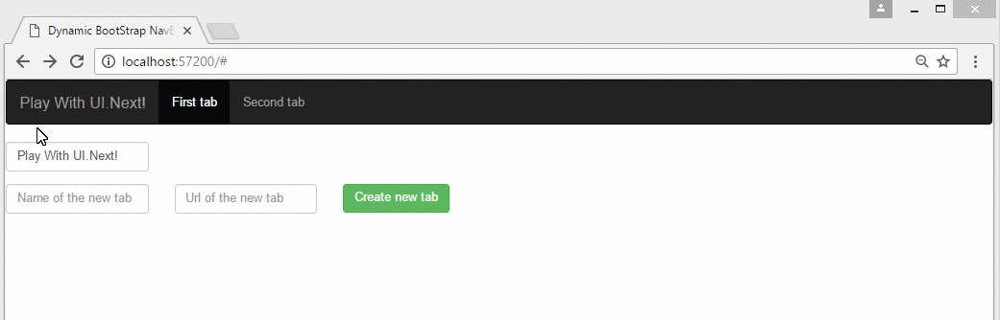

Single Page Application SPA
**Single Page Application** é uma aplicação ou web site que interage com o usuário de forma dinâmica sem que precise recarregar novos arquivos. Todos os arquivos necessários para o site ou aplicação funcionar são baixados apenas uma vez e depois são iterados sem afetar a experiência do usuário, deixando uma navegação mais fluída e natural. Essa navegação mais fluida de sites trás para a web a mesma experiência que temos em aplicativos desktop.

Como todos os arquivos são baixados de uma vez direto do servidor as mudanças no site ocorrem conforme o usuário interage com os recursos presentes no front-end. Grande parte dessas mudanças são feitas utilizando Javascript que faz requisições de dados para o servidor, essas dados normalmente são retornados em JSON e "alimentam" o site com as informações retornadas.

O conceito de [Single Page Application](https://en.wikipedia.org/wiki/Single-page_application) é antigo, tendo sua discussão iniciada por volta de 2003, porém sua grande abordagem veio nos últimos anos com bibliotecas e frameworks focados no front-end, como React, Angular, Vue, Ember, entre outros. Essas tecnologias veêm revolucionando o desenvolvimento web simplesmente pela parte de que todo o site ou aplicação pode ser manipulado através do DOM utilizando Javascript.
Single Page Application Exemplo
O grande "diferencial" destes novos recursos em front-end utilizando como base o SPA é que sua página pode trabalhar com o sistema de componentes, onde cada elemento dentro de seu layout funciona de maneira independente, então você pode atualizar uma informação no header sem ter que recarregar a página ou trazer um feed de noticias atualizado sem precisar dar reload no navegador.

Caso nunca tenha testado esta nova tecnologia recomendo que crie um novo projeto para entender e assimilar melhor como funciona, creio que será muito interessante para abrir sua mente em relação a aplicativos e sistemas web modernos.

Até mais!
